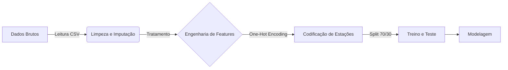

# Trabalho Final: Previsão da Qualidade do Ar (PM2.5)

Este projeto consolida o aprendizado da disciplina de Ciência de Dados, aplicando o ciclo completo de um projeto de dados: da definição do problema ao deploy de um modelo de **Regressão**.

**Disciplina:** Ciência de Dados (Avaliação N3)
**Data de Entrega:** 01/12/2025

## Integrantes do Grupo
* [Nome do Aluno 1]
* [Nome do Aluno 2]
* [Nome do Aluno 3] (se houver)

---

## Estrutura do Repositório

O projeto está organizado conforme os requisitos da avaliação:

* `README.md`: Relatório técnico e guia de execução do projeto.
* `/notebooks`: Contém o Jupyter Notebook principal (`regressao_qualidade_do_ar.ipynb`).
* `/scripts`: Scripts auxiliares em Python (`train_model_air.py`).
* `/data`: Pasta reservada para o dataset.
* `requirements.txt`: Lista de bibliotecas necessárias.
* `modelo_final.pkl`: O modelo preditivo treinado e serializado.

---

## 1. O Problema de Negócio

### 1.1 Contexto
A poluição do ar é um dos maiores desafios de saúde pública em grandes metrópoles como São Paulo. O monitoramento preciso de partículas finas (PM2.5) é crucial, pois elas penetram profundamente no sistema respiratório.

### 1.2 Pergunta de Negócio
*"É possível prever a concentração de PM2.5 em uma estação de monitoramento com base nas concentrações de outros poluentes (como CO, NO2, O3) e na localização da estação?"*

### 1.3 Objetivo do Modelo
Desenvolver um modelo de **Regressão** capaz de estimar o valor numérico da concentração de PM2.5 (variável alvo) a partir das demais variáveis ambientais, servindo como ferramenta de preenchimento de falhas em sensores ou validação de dados.

---

## 2. Pipeline de Dados

O fluxo de processamento dos dados seguiu as etapas abaixo:


Detalhes do Pipeline (ETL):

### 2.1 Ingestão: O dataset sp_air_quality_clean.csv foi carregado.

### 2.2 Limpeza:

  ### 2.2.1 - Valores numéricos ausentes foram preenchidos com a mediana.

  ### 2.2.2 - Valores categóricos foram preenchidos com a moda.

### 2.3 Transformação:

 ###  2.3.1 - A coluna Station (categórica) foi transformada em colunas numéricas binárias utilizando One-Hot Encoding (pd.get_dummies), permitindo que o modelo matemático interprete a localização.

### 2.4 Divisão: Separação em dados de Treino (70%) e Teste (30%).

## 3. Modelagem e Avaliação Comparativa 
Para resolver o problema de regressão, foram treinados e avaliados três algoritmos distintos:

### 3.1 Regressão Linear: Modelo base (baseline) para entender a linearidade dos dados.

### 3.2 Regressão Ridge: Modelo linear com regularização L2 para evitar overfitting.

### 3.3 Árvore de Decisão (Regressor): Modelo não-linear capaz de capturar padrões mais complexos.

### Métricas Utilizadas
  - RMSE (Root Mean Squared Error): Penaliza erros maiores, essencial para evitar previsões de poluição drasticamente erradas.

  - MAE (Mean Absolute Error): Mede a média absoluta do erro.

  - R² (R-Squared): Indica o quão bem as variáveis explicam a variação do PM2.5.

## 4. Como Executar (Google Colab)
Você pode executar este projeto diretamente no navegador utilizando o Google Colab.

Passo a Passo no Colab:
### 4.1 - Clique no botão acima para abrir o notebook.

### 4.2 - Upload dos Dados: Como o Colab não baixa automaticamente a pasta /data, você precisará fazer o upload do arquivo sp_air_quality_clean.csv na aba de arquivos (ícone de pasta à esquerda) do Colab.

### 4.3 - Instalação de Dependências: Execute a célula de instalação (se houver) ou certifique-se de que as bibliotecas padrão (pandas, sklearn, numpy) estejam ativas.

### 4.4 - Execução: Vá no menu "Runtime" (Ambiente de Execução) e clique em "Run all" (Executar tudo).

## 5. Deploy do Modelo 
O modelo final foi salvo no arquivo modelo_final.pkl. Para utilizá-lo em produção para fazer novas previsões:
```
import joblib
import pandas as pd

# 1. Carregar o modelo treinado
modelo = joblib.load('modelo_final.pkl')

# 2. Criar um novo registro com as features que você tem em mãos
# Nota: Não precisa listar todas as estações aqui, apenas a ativa.
dicionario_dados = {
    'Benzene': [3.5],
    'CO': [1.2],
    'PM10': [25.0],
    'NO2': [40.0],
    'O3': [15.0],
    'SO2': [5.0],
    'Toluene': [6.0],
    'TRS': [2.0],
    'Station_Pinheiros': [1]  # Exemplo: estamos na estação Pinheiros
}

novo_dado = pd.DataFrame(dicionario_dados)

colunas_esperadas = modelo.feature_names_in_
novo_dado = novo_dado.reindex(columns=colunas_esperadas, fill_value=0)

# 3. Fazer a previsão
previsao = modelo.predict(novo_dado)
print(f"Concentração Prevista de PM2.5: {previsao[0]:.2f} µg/m³")
